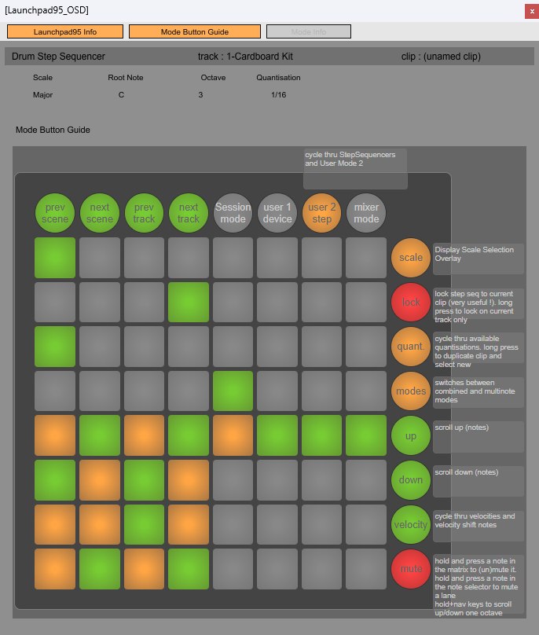

# Launchpad95 OSD Mod (Launchpad98)

This project adds a dynamic on-screen display (OSD) and documentation assets on top of the original Launchpad95 Remote Script. It is intended to be layered on top of a standard Launchpad95 installation so it can be shared as a mod overlay.

## UI Examples
These screenshots show the Launchpad98 OSD UI reacting to the selected mode, with Launchpad95 info at the top and toggleable sections. Images sourced from the Launchpad95 manual.




## Installation Instructions
**Download the original Launchpad95 first**
```
https://motscousus.com/stuff/2011-07_Novation_Launchpad_Ableton_Live_Scripts/
```

**Install Launchpad95 (base)**
1. Download and unzip Launchpad95 from the link above.
2. Copy the `Launchpad95` folder into your Ableton Remote Scripts folder.
3. Example path (Windows):
```
C:\Users\<You>\Documents\Ableton\User Library\Remote Scripts\Launchpad95
```
If you don’t already have Launchpad95 installed, you must download and install it first from:
```
http://motscousus.com/stuff/2011-07_Novation_Launchpad_Ableton_Live_Scripts/
```

**Install this mod (overlay)**
1. From this project, copy the modified files on top of the base `Launchpad95` folder.
2. Overwrite when prompted.
3. Use `MOD_OVERLAY_GUIDE.md` to see exactly which files are changed/added.
4. If you are using the drop-in zip, unzip it and copy its contents directly into your existing `Launchpad95` folder, then overwrite.

**Install the OSD device**
1. The modded OSD device is:
```
M4LDevice\Launchpad98OSD.amxd
```
2. Recommended: keep the entire `M4LDevice` folder together so the device can load `L95_ext.js` and the JSON UI sections.
3. If you copy the `.amxd` into Ableton's Max for Live Presets folder, make sure these folders are still in Max's search path:
```
M4LDevice\
Launchpad95 Mode Screenshots\
```

## Which OSD should I use?
The dynamic behavior comes from `M4LDevice\L95_ext.js`. The modded OSD (`Launchpad98OSD.amxd`) is recommended because it includes the UI sections used by the script (info, mode guide, mode info). The original OSD can show basic info, but it will not expose all sections or dynamic layout features.
If you want, you can also run the Launchpad98 OSD alongside the original Launchpad95 OSD (for example, to keep the Launchpad95 Info in a separate window).

